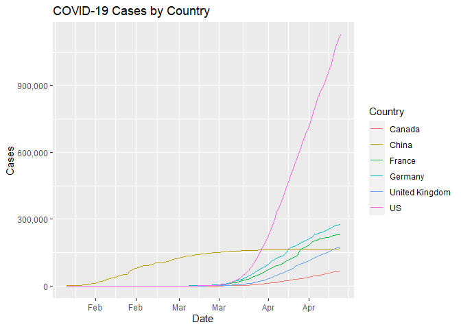
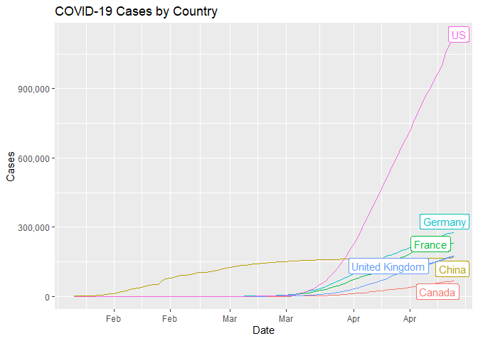
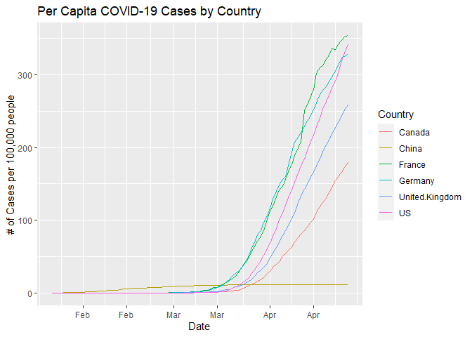
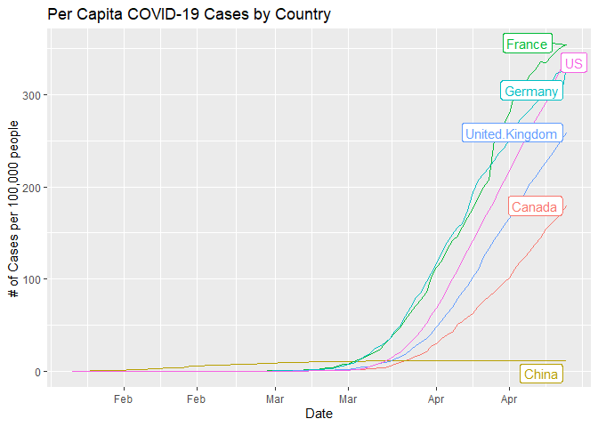

Visualize COVID-19 Data in R
================

My attempt to do the same [Python
visualization](https://towardsdatascience.com/visualizing-covid-19-data-beautifully-in-python-in-5-minutes-or-less-affc361b2c6a)
of COVID-19 data in R.

First, let’s load the needed libraries.

``` r
# previously used pandas and matplotlib in python
library(ggplot2)
```

    ## Warning: package 'ggplot2' was built under R version 3.6.3

``` r
library(dplyr)
```

    ## Warning: package 'dplyr' was built under R version 3.6.3

    ## 
    ## Attaching package: 'dplyr'

    ## The following objects are masked from 'package:stats':
    ## 
    ##     filter, lag

    ## The following objects are masked from 'package:base':
    ## 
    ##     intersect, setdiff, setequal, union

``` r
library(tidyr)
```

    ## Warning: package 'tidyr' was built under R version 3.6.2

I’m loading csv data from a url.

``` r
data_all <- read.csv("https://raw.githubusercontent.com/datasets/covid-19/master/data/countries-aggregated.csv")
```

Next, I’ll select certain countries from this data for simplicity.

``` r
cond <- c("Canada", "Germany", "United Kingdom", "US", "France", "China")

data_coun <- data_all %>%
  filter(Country %in% cond) 

# View(data_coun)
```

We want a summary column that aggregates the Confirmed, Recovered and
Deaths columns.

``` r
data_cases <- data_coun %>% 
  replace(is.na(.), 0) %>% 
  mutate(Cases = rowSums(.[3:5])) %>%
  select(Date, Country, Cases)
```

Let’s reshape the table so that each column is a country with the number
of cases as the values.

``` r
data_wide <- data_cases %>%
  spread(Country, Cases)
```

To get per capita data, we need to calculate case rates per 100,000
people.

``` r
# create a data table of each country's population
Country <- c("Canada",  "China", "France", "Germany", "United Kingdom", "US")
Population <- c(37664517, 1438027228, 65239883, 83721496, 67802690, 330548815)
pop <- data.frame(Country, Population)

# copy the current table of cases
percapita <- data.frame(data_wide)

# fill in cases per capita based on population
for (i in 2:length(percapita)) {
  percapita[i] <- percapita[i] / Population[i-1] * 100000
}
```

Now let’s chart the total cases data first\! Note: have to use the
“long” data (data\_cases) rather than the “wide” data (data\_wide)
for ggplot

``` r
# convert into date class
library(lubridate)
```

    ## Warning: package 'lubridate' was built under R version 3.6.3

    ## 
    ## Attaching package: 'lubridate'

    ## The following objects are masked from 'package:dplyr':
    ## 
    ##     intersect, setdiff, union

    ## The following objects are masked from 'package:base':
    ## 
    ##     date, intersect, setdiff, union

``` r
data_cases$Date <- ymd(data_cases$Date)

# format numbers on an axis
library(scales) 
```

    ## Warning: package 'scales' was built under R version 3.6.2

``` r
# version with legend
data_cases %>%
  # multiple lines on the same chart
  ggplot(aes(x = Date, y = Cases, group = Country, color = Country)) +
  geom_line() +
  # add title
  ggtitle("COVID-19 Cases by Country") +
  # format as month
  scale_x_date(date_labels = "%b", breaks = scales::pretty_breaks(10)) +
  # separate thousands
  scale_y_continuous(labels = comma)
```

<!-- -->

``` r
# version with ggrepel labels
library(ggrepel)
```

    ## Warning: package 'ggrepel' was built under R version 3.6.3

``` r
data_cases %>%
  mutate(label = if_else(Date == max(Date), as.character(Country), NA_character_)) %>%
  # multiple lines on the same chart
  ggplot(aes(x = Date, y = Cases, group = Country, color = Country)) +
  geom_line() +
  # add title
  ggtitle("COVID-19 Cases by Country") +
  # format as month
  scale_x_date(date_labels = "%b", breaks = scales::pretty_breaks(10)) +
  # separate thousands
  scale_y_continuous(labels = comma) +
  geom_label_repel(aes(label = label),
                   nudge_x = 1,
                   na.rm = TRUE) +
  # remove legend
  theme(legend.position = "none")
```

<!-- -->

Finally, let’s chart the per capita data.

``` r
# need to convert per capita data from wide to long
percapita_long <- percapita %>%
  pivot_longer(-Date, names_to = "Country", values_to = "Cases")

# then we can do the same viz as before
# convert into date class
library(lubridate)

percapita_long$Date <- ymd(percapita_long$Date)

# format numbers on an axis
library(scales) 

# version with legend
percapita_long %>%
  # multiple lines on the same chart
  ggplot(aes(x = Date, y = Cases, group = Country, color = Country)) +
  geom_line() +
  # add title
  ggtitle("Per Capita COVID-19 Cases by Country") +
  # add a y-axis label
  labs(y = "# of Cases per 100,000 people") +
  # format as month
  scale_x_date(date_labels = "%b", breaks = scales::pretty_breaks(10)) +
  # separate thousands
  scale_y_continuous(labels = comma)
```

<!-- -->

``` r
# version with ggrepel labels
library(ggrepel)
percapita_long %>%
  mutate(label = if_else(Date == max(Date), as.character(Country), NA_character_)) %>%
  # multiple lines on the same chart
  ggplot(aes(x = Date, y = Cases, group = Country, color = Country)) +
  geom_line() +
  # add title
  ggtitle("Per Capita COVID-19 Cases by Country") +
  # add a y-axis label
  labs(y = "# of Cases per 100,000 people") +
  # format as month
  scale_x_date(date_labels = "%b", breaks = scales::pretty_breaks(10)) +
  # separate thousands
  scale_y_continuous(labels = comma) +
  geom_label_repel(aes(label = label),
                   nudge_x = 1,
                   na.rm = TRUE) +
  # remove legend
  theme(legend.position = "none")
```

<!-- -->
